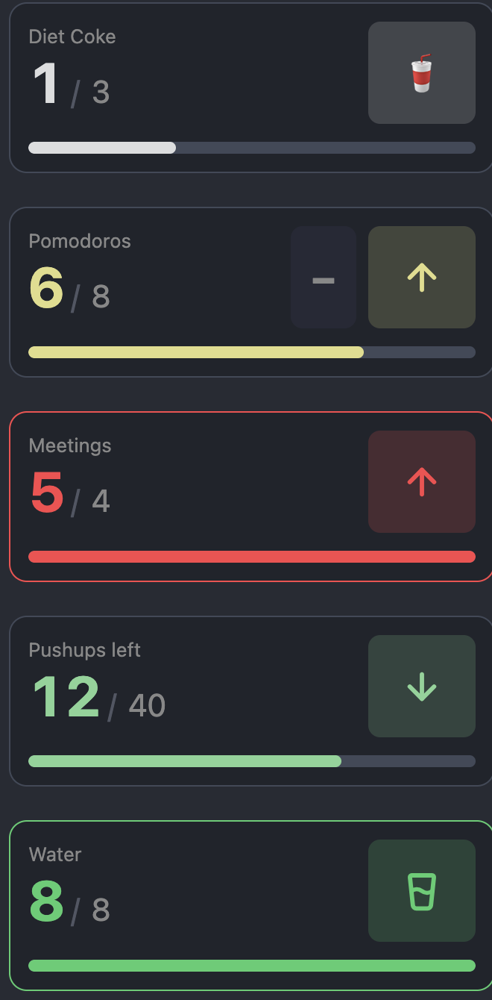

# Tally

Big, tappable counters for [Obsidian](https://obsidian.md). Track how much of something you've used up (or how far you've come) with one tap, on desktop and mobile.

<p align="center">
  
</p>

## Usage

A `tally` code block with one line: an optional label, `count / max`, and optional words in parentheses.

````markdown
```tally
Diet Coke: 1 / 3
```
````

- Tap the big button to count. Tap the max number to change it; the dialog resets the count by default.
- Colour stays neutral for the first half, then warms through yellow and orange, and turns red past the max.
- The block is rewritten in place, so your note stays plain markdown (`Diet Coke: 2 / 3`).

### Options

| Word | Meaning |
| --- | --- |
| `up` | count climbs from 0 toward max (default) |
| `down` | count descends from max toward 0; reset returns it to max |
| `bad` | reaching max is a limit: neutral → yellow → orange, red past it (default) |
| `good` | reaching max is a goal: neutral → green |
| `reverse` | also show a small button that steps the other way, for corrections |
| `icon: <name>` | button icon for this block: a [Lucide](https://lucide.dev/icons) name or an emoji |

````markdown
```tally
Pushups left: 40 / 40 (down, good)
```

```tally
Water: 0 / 8 (good, icon: glass-water)
```

```tally
Pomodoros: 0 / 8 (reverse, icon: 🍅)
```
````

The command **Tally: Insert counter** drops a new block at the cursor. Settings let you change the default up and down icons.

## Install

Not yet in the community plugin list. Until then:

- **BRAT**: install [BRAT](https://github.com/TfTHacker/obsidian42-brat), then *Add beta plugin* with `geddski/obsidian-tally`.
- **Manual**: download `main.js`, `manifest.json` and `styles.css` from the [latest release](https://github.com/geddski/obsidian-tally/releases/latest) into `<vault>/.obsidian/plugins/tally/`, then enable Tally under *Community plugins*.

## Development

```
bun install
bun run dev      # watch build → main.js
bun run build    # typecheck + minified build
bun run lint
```

Symlink the repo into a vault's `.obsidian/plugins/tally` to run it live. With the [Hot Reload](https://github.com/pjeby/hot-reload) plugin installed, the `.hotreload` marker reloads Tally on every rebuild.

Releases: bump with `npm version patch|minor|major`, then push the tag. The release workflow builds and attaches the artifacts.
